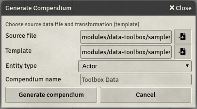

# Data Toolbox - CSV Importer

This part of the module provides tools for generating compendium based on structured data.

**Typical use case**: 
 * Import data from https://www.d20pfsrd.com



*The module also includes data samples for testing purposes.* 

### Use data toolbox

* The module provides a compendium with a macro
* Open the `Data macros` compendium
* Import the `Show Toolbox` and execute it
  * As source file, browse or enter the following path: `modules/data-toolbox/samples/bestiary-sample.csv`
  * As template file, browse or enter the following path: `modules/data-toolbox/samples/creature-template.json`
  * Choose `Actor` as entity type
* Click on `Generate compendium` button
* Wait until process is completed (99 creatures)
* Take a look at the newly created compendium "Toolbox Data"
* Notice that creatures have been added to the compendium with their names and abilities

See also: [tutorials](tutorials/README.md)

### How does it work?

The utility reads the input file, line by line, and generates an entry into the compendium by using the provided template.

It requires data (*source file*) to be structured and stored using [CSV format](https://en.wikipedia.org/wiki/Comma-separated_values).
* The data must be clean
* The header (first record) must exist and provide column names
* If the second record contains the word "sample" on the first column, all the other columns will be used to determine the default values

See: [samples/bestiary-sample.csv](../samples/bestiary-sample.csv)

It requires a template in JSON format with variables matching headers from the CSV file. In the example below, `{{Name}}` will be replaced by the value of the column `Name` from the input file.

```
{
  "name": "{{Name}}",
  "type": "npc",
  "data": {}
}
```

See: [samples/creature-template.json](../samples/creature-template.json)

### Important to know

* If you have two columns with the same name, the toolbox will only consider only the last one
* Toolbox will detect if a column is of type text or number (based on the first value found).
* If a number is mixed with text, the tool will warn you and the console will show you details
* If a sample line is provided, the toolbox will use the provided default value for empty fields
* If a sample line is not provided, the toolbox will use `0` as default for numbers and `""` for strings
