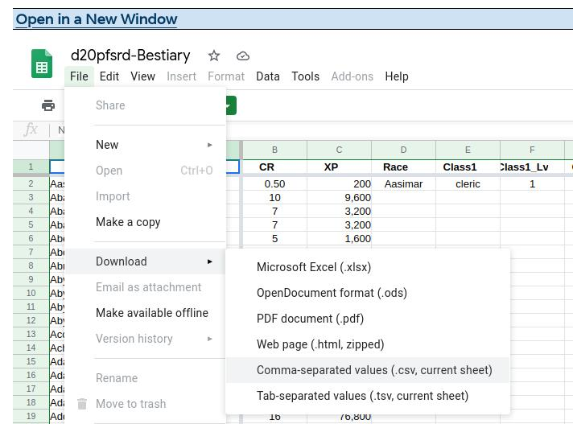
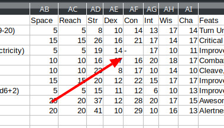
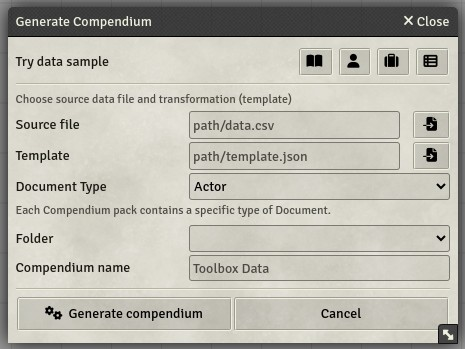
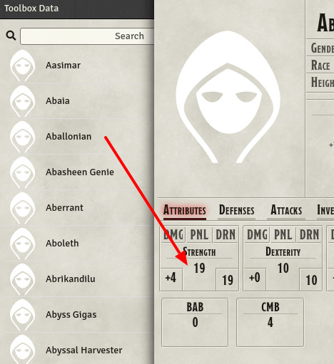

# Tutorial: import monsters from d20PFSRD database

This tutorial presents (step-by-step) how to import the top 100 monsters from the [d20PFSRD monsters DB](https://www.d20pfsrd.com/bestiary/tools/monster-filter).

**Pre-requisites**:
* [LibreOffice](https://www.libreoffice.org/), MS Office, Google Docs or any software for spreadsheets
* Understanding the CSV ([comma-separated values](https://en.wikipedia.org/wiki/Comma-separated_values)) format
* Understanding the JSON ([JavaScript Object Notation](https://fr.wikipedia.org/wiki/JavaScript_Object_Notation)) format
* Installation of [Foundry VTT](https://foundryvtt.com/)
* Module "Data Toolbox" installed and enabled in Foundry VTT
* Access to database files (`$FVTT_HOME/Data/worlds/`)

## Prepare the data to import

The first step consists in preparing the input data. The data toolbox has following requirements:
1. Data must be stored using the CSV ([comma-separated values](https://en.wikipedia.org/wiki/Comma-separated_values)) format
1. Input file must include a header with column names
1. Data must be clean

#### Data must be stored using the CSV format 

* Visit d20PFSRD Monster database page: https://www.d20pfsrd.com/bestiary/tools/monster-filter
* Download the data as CSV file. You could also download it as Excel or OpenDocument and convert it later



* Open the file in your favorite editor. I recommend [LibreOffice](https://www.libreoffice.org/) which is open-source and can handle CSV file pretty well.
* Make sure that the data is correctly loaded (`Name`, `CR` and `XP` are the first three columns)
* Only keep the first 10 lines. It's easier to test the import with a small volume of data

#### Input file must include a header with column names

* Notice that the first line contains the headers (i.e. name of the fields)
* Don't remove that line! You can rename each individual field if you want but they must be **unique**.

#### Data must be stored using the CSV format 

* For the data to be clean, you must ensure that the columns that contain numbers are not mixed with text. In the data sample, the third creature (*Aballonian*)
is a construct that doesn't have a constitution and its value is represented by '-'. The toolbox won't be able to handle this and will fail trying to convert
it into a number. Replace it with 0.



* In the entire dataset, numbers are mixed with text like "15 with slam" or "20 with tongue". You need to remove the text and only keep the number
* Tip: you can clean it by selecting the column and use the "replace" function (CTRL+H). Make sure to apply the replacement only to the selection.

## Prepare the template

In order to prepare the template, you need to know which format Foundry VTT uses to store the actor in the database. The easiest way to know it
consists in creating an Actor inside the application and retrieve it from the database file

* Create a new world `myworld` in Foundry VTT with the desired system
* Create a new actor `myactor`
* Open your file browser and navigate to the home installation of Foundry VTT
  * `$HOME/.local/share/FoundryVTT/` for Linux
  * `%localappdata%\FoundryVTT` for Windows
* Navigate to the newly created world, where data is stored: `Data/worlds/myworld/data`
* Open the file `actors.db` in your favorite Text editor
* The last line contains the actor that you created. Copy the entire line which looks like this:
```
{"_id":"XdUZYXF881FHO3bh","name":"myactor","permission":{"default":0,"FgnRmbsZ0zuxNbBw":3},...
```
* Go on the https://jsonformatter.org webpage and past the line into the area on the left. You will get an human-readable JSON file on the right. If you get an error, that means that you didn't copy the entire line properly in the previous step. Try with another text editor if needed.

You now have the JSON format that Foundry VTT uses for storing an actor. Most of the fields are generated and not required. In the next steps, we'll prepare a simple template
which contains only a few fields for testing. 

* Store the human-readable JSON into a file (`template.json`)
* Remove all the entries but `name`, `type` and `data/abilities`. Keep only `str` (strength) for testing purposes
* If you are using the system pf1 (pathfinder v1), you should get the following template:

```
{
  "name": "myactor",
  "type": "character",
  "system": {
    "abilities": {
      "str": {
        "total": 10,
        "mod": 0,
        "value": 10,
        "carryBonus": 0,
        "carryMultiplier": 1,
        "checkMod": 0,
        "damage": 0,
        "drain": 0,
        "penalty": 0,
        "userPenalty": 0
      }
    }
  }
}
```

* As mentionned, most of the fields are not required. Actually, we only want to set the value for the ability `str`. The final template will then look like:
```
{
  "name": "myactor",
  "type": "character",
  "system": {
    "abilities": {
      "str": {
        "value": 10
      }
    }
  }
}
```

* We now have to remplace the values by variables that will be used during the import
* Variable are represented by `{{variable-name}}` annotation where `variable-name` must match the column name from the CSV file
```
{
  "name": "{{Name}}",
  "type": "character",
  "system": {
    "abilities": {
      "str": {
        "value": {{Str}}
      }
    }
  }
}
```

* Make sure to keep the double-quotes for text values (like `Name`) but not for numbers (like `Str`)
* Your first template is ready for testing!!


## Execute

* In order to import the data into a compendium, you will need the two files to be accessible from Foundry VTT. 
In the Foundry application, you can upload it from the file picker but I recommand to store it directly into a folder
in the HOME folder of Foundry, such you can do changes from your editor without having to re-upload the changed files
everytime.
* The module (Data Toolbox) provides a compendium with a macro
* Open the `Data macros` compendium
* Import the `Show Toolbox` and execute it
  * As source file, browse and select your input file. Ex: `/data/d20pfsrd.csv`
  * As template file, browse and select your template file. Ex: `/data/template1.csv`
  * Choose `Actor` as entity type



* Click on `Generate compendium` button
* Wait until process is completed (10 creatures)
* Take a look at the newly created compendium "Toolbox Data"
* Notice that creatures have been added to the compendium with their names and ability `str`



**You successfully used the Data Toolbox for Foundry!!**. You can now include more parts of the full JSON template, replace values with variables from the CSV and repeat the import by clicking on `Generate compendium` button again.

* Compendium will be overwritten by successive executions
* If the operation fails, checks the console logs for more information. Most of the time, it's related to the template file which doens't have a valid JSON format. Copy-paste the generated JSON data into a validator like https://jsonformatter.org to identify the issue.

